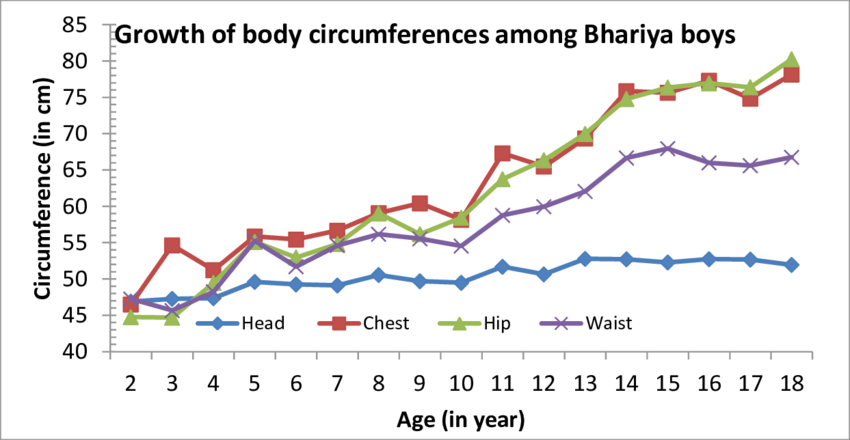
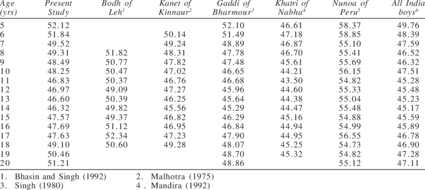

## Data Collection
Relation and dependence of Tidal Volume (and other related factors of Lung function) were analyzed. Due to the absence of any data on the tidal volume, datasets with other lung volume parameters were considered, such as Total Lung Capacity (TLC), and Inspiratory Capacity (IC).

A simple possibility of using Kaggle [Lung Volume dataset](https://www.kaggle.com/datasets/radhakrishna4/lung-capacity) was considered but decided against because of - 
- lack of clarity of source of data
- inconsistencies throughout data regarding height and age
- data skewed for minors (data only till age <19)

Through the assessment of quality of data, the dataset where the Inspiratory Capacity data is taken was [Global Lung Function Initiative](https://breathe.ersjournals.com/content/13/3/e56), where the cumulative data from thousands of medical institutions were taken (and several parameters are available, however tidal volume was not available). As the data is not public and we can search by placing the parameters to get a median value of our parameter (IC), there was a need to get sample data for the input parameters (in our situation age, height and sex). The [WHO age weight chart](https://www.who.int/tools/growth-reference-data-for-5to19-years/indicators/height-for-age) was used as a reference for minor (starting from 5) heights till age 19, while the heights above (till age 70) were randomized around the median height for a particular sex. 

<u>As a sample step, all ages were given one patient of each sex and dataset was made in excel format.</u>
 At this step we can take multiple people with a distribution more resembling actual population. Another idea could be a population resembling common hospital demographic. These can be implemented in a future revision, or for a more detailed study.

### Data sufficiency
[Paper 1](https://www.sciencedirect.com/science/article/pii/S1746809422003238) was studied, wherein parameters used were Sex, Weight, Height, Chest circumference and Age (and derived parameter BMI), for training several models such as Linear Regression and Multivariable Logistic Regression. Papers were found with [contradictory results regarding role of weight](https://doi.org/10.1038/s41598-019-38804-3) in the calculation of tidal volume (with possible resolution through calculation of central obesity). Therefore, it was assumed that the possible exclusion of weight from the parameters would not affect our calculation significantly. 

<u>However, if weight is to be factored in </u>

then we can see results from IBW (Ideal Body Weight) calculation by anaesthetics and [medical equipment](https://www.gehealthcare.co.uk/-/jssmedia/gehc/uk/images/products/carestation-600/cs600v2-lpv-clinical-focus-guide_jb27087xx.pdf) responsible for setting of the Tidal Volume. It has also been used in [biometric tidal volume calculation equipment](https://pubmed.ncbi.nlm.nih.gov/30857509/).

 

Regarding chest circumference, it shows strong correlation with age (for minors) and stays almost same after age of ~20.

Therefore, it can be approximated to be correlated to height, which agrees (upto some error for different demographics) with the data from the below image.

### Data augmentation
We can add data with random increase/decrease upto `5%` variations in height (with same IC). Adding 2 such examples per age per sex can give us `66*2*3 = 396` total data samples which were used for training/testing.

### IC => TV
By an estimate, we see that Tidal Volume is approximately 1/6th of the Inspiratory Reserve Volume. Hence, we see that `IC ~ 7*TV`
### Results
In all the below results `score` is defined to be 

`u = ((y_test - y_predicted) ** 2).sum()`

`v = ((y_test - y_test.mean()) ** 2).sum()`

score = `1 - (u/v)`
- Linear Regression
  
  Score: `0.82`

- Polynomial Regression
  
  Score: `0.92`

- Support Vector Regression (SVM)

  Score: `0.96`

After these were trained using sklearn, all were saved (as python objects).

### How to use
1. Run `pip install -r requirements.txt`
2. Execute 
`python demo.py --age 15 --sex F --height 132.3` or with other parameters per your requirement.
We can also programmatically do this from other python code by doing `from demo import predict` with `predict(age, height, sex)` taking same parameters as the cmd line.